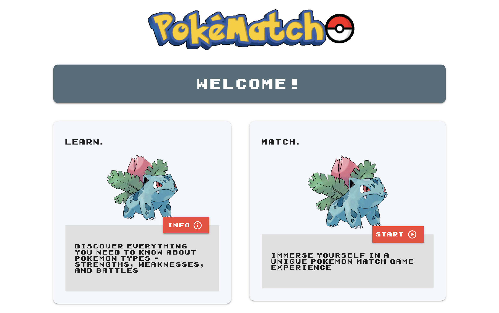

# Pokematch

## Description
An application designed to inform users about different Pokèmon types. Users will then be able to test their knowledge through a Pokèmon match up game. 

## Installation
1. Clone from repo.
2. Open folder with visual studio code or any text editor of choice.
3. Run index.html to run code.

## Usage

This is our home screen. There are two ways to "play". The info button on the first card titled "Learn" will take the user to the Pokedex page. The start button on the second card titled "Match" will take the user to the Game page.

This is the Pokedex page. On the left side, there are many type options available for the user to select. On the right, a picture of a Pokèmon will generate, as well as some information about the Pokèmon that will be useful to the user during the Game mode. 

## Technologies
https://materializecss.com/

https://pokeapi.co/docs/v2

https://www.mediawiki.org/wiki/API:REST_API/Reference

## Deployed Website Link
